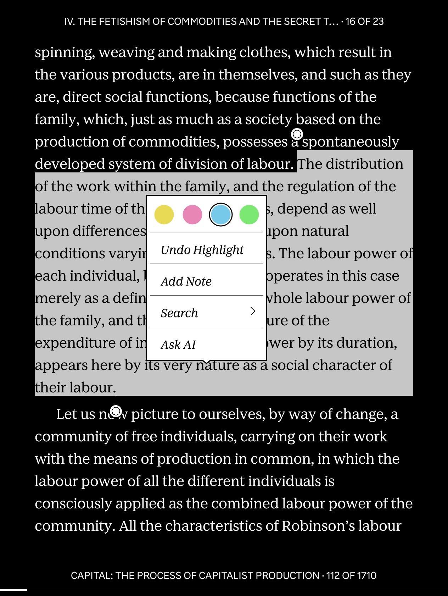
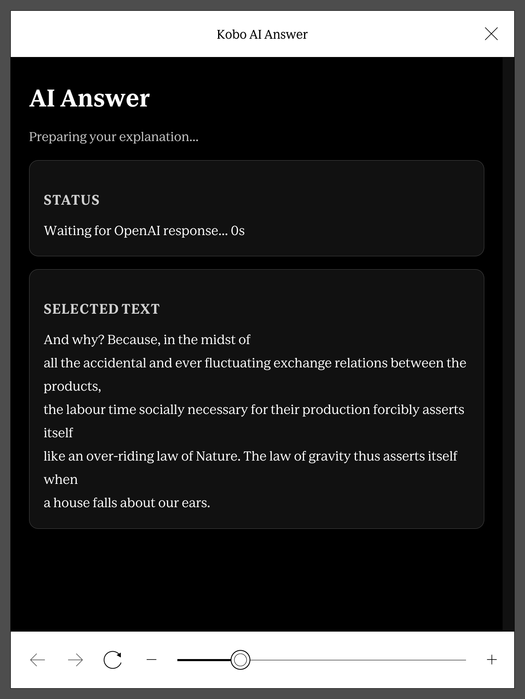
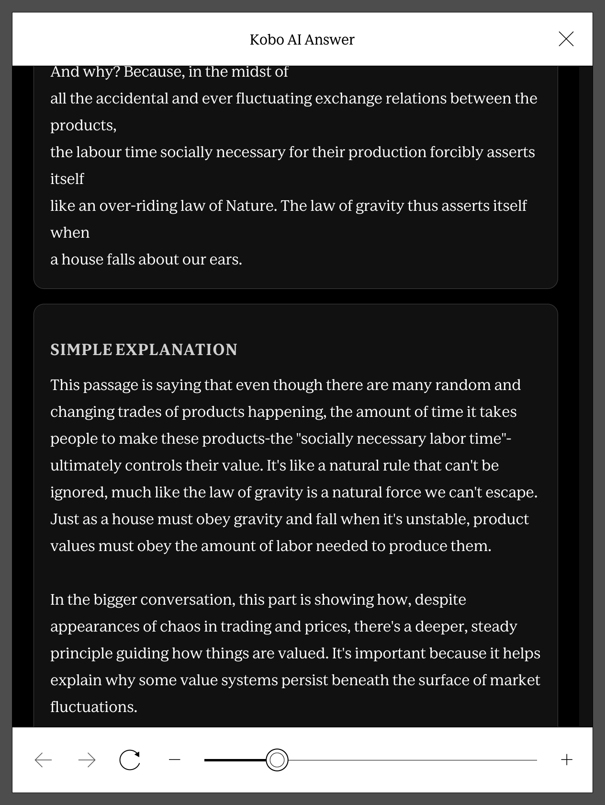

# Kobo AI Companion

Use a Kobo text selection to ask an LLM for a simple explanation while staying in the stock Nickel reading flow.

The current repo is Lua-first:

- NickelMenu launches `Ask AI` from the selection menu
- a loading page opens immediately in `nickel_browser`
- one Lua backend command either reuses a cached answer or calls the provider
- that same command updates the SQLite cache and overwrites one stable result page

The browser UI is intentionally simple for e-ink:

- black background
- white text
- white borders only
- larger reading-sized type

## Screenshots

Selection and launch flow:



Generated answer view:

<table>
  <tr>
    <td></td>
    <td></td>
  </tr>
</table>

To capture your own screenshots while testing UI changes on-device:

- turn screenshots on with the NickelMenu item `Screenshots On/Off`
- then press the Kobo power button to save a PNG screenshot
- screenshots are saved to the top level of the Kobo storage

Under the hood this uses Kobo's `FeatureSettings.Screenshots=true` setting.

## Repo Layout

```text
.adds/
  ai/
    config.env.example
    debug_latest_highlight.sh
    loading_page.html.tmpl
    lua/
      config.lua
      db.lua
      log.lua
      main.lua
      prompts.lua
      render.lua
      request_types.lua
      requests.lua
      runtime.lua
      worker.lua
      providers/
        init.lua
        mock.lua
        openai.lua
    open_explanation_request_lua.sh
    page_styles.css
    prompt_template.tmpl
    request_page.html.tmpl
    run_explanation_request_lua.sh
    run_lua_backend.sh
  bin/
    curl
    lua
    sqlite3
  certs/
    cacert.pem
  nm/
    config
docs/
  lua-architecture.md
tests/
  test_lua_run_flow.sh
```

## Main Pieces

- `.adds/ai/open_explanation_request_lua.sh`
  NickelMenu entrypoint. Writes the loading page through Lua, then backgrounds the actual request runner.
- `.adds/ai/run_explanation_request_lua.sh`
  Tiny shell wrapper that runs the Lua backend `run` command for one selection.
- `.adds/ai/run_lua_backend.sh`
  Finds the bundled Lua runtime and executes `lua/main.lua`.
- `.adds/ai/lua/main.lua`
  Main application entrypoint. Supports `open`, `run`, `runtime-info`, and `debug`.
- `.adds/ai/lua/runtime.lua`
  Resolves paths, bundled binaries, writable state directories, and helper file locations.
- `.adds/ai/lua/db.lua`
  SQLite adapter built on top of the bundled `sqlite3` CLI.
- `.adds/ai/lua/requests.lua`
  Cache lookup, request insertion, and state/result persistence.
- `.adds/ai/lua/request_types.lua`
  Seeds and resolves request-type configuration.
- `.adds/ai/lua/prompts.lua`
  Seeds and renders prompt templates.
- `.adds/ai/lua/providers/openai.lua`
  OpenAI Responses API provider.
- `.adds/ai/lua/render.lua`
  Renders the loading page and the final result page.
- `.adds/ai/prompt_template.tmpl`
  Editable explanation prompt template.
- `.adds/ai/loading_page.html.tmpl`
  Initial page shown immediately after the menu action.
- `.adds/ai/request_page.html.tmpl`
  Final result page template used for both fresh and cached responses.

## Current Flow

1. Select text in a book.
2. Tap `Ask AI`.
3. NickelMenu starts `open_explanation_request_lua.sh`.
4. That shell wrapper runs `main.lua prepare`, which writes `output/latest_ai_answer.html` as the loading page.
5. The same shell wrapper backgrounds `run_explanation_request_lua.sh`.
6. That second shell wrapper runs `main.lua run`.
7. Lua renders the prompt and computes a request hash.
8. If a matching completed request exists in SQLite, the cached answer is reused.
9. Otherwise the provider is called and the fresh result is stored.
10. The same backend command overwrites `output/latest_ai_answer.html` with the final answer.

The database is used as a cache and request history store, not as a live browser-state source.

## Database

The SQLite file is:

- on Kobo: `/mnt/onboard/.adds/ai/requests.db` by default
- browser output: `/mnt/onboard/.adds/ai/output/latest_ai_answer.html`

Main tables:

- `prompt_library`
- `providers`
- `request_types`
- `requests`

The important cache key is `request_hash`, derived from:

- model
- rendered prompt body

So identical prompts can reuse completed responses.

## Prerequisites

You need:

- a Kobo device
- NickelMenu installed
- an OpenAI API key
- USB access to copy files onto the Kobo

This repo bundles the runtime pieces the addon expects:

- `.adds/bin/curl`
- `.adds/bin/sqlite3`
- `.adds/bin/lua`
- `.adds/certs/cacert.pem`

## Install

### 1. Install NickelMenu

Primary repo:

- https://github.com/pgaskin/NickelMenu

Releases:

- https://github.com/pgaskin/NickelMenu/releases

### 2. Copy `.adds` To Kobo

Copy the repo’s `.adds` tree onto the device so the Kobo ends up with:

```text
/mnt/onboard/.adds/ai/config.env.example
/mnt/onboard/.adds/ai/debug_latest_highlight.sh
/mnt/onboard/.adds/ai/loading_page.html.tmpl
/mnt/onboard/.adds/ai/lua/...
/mnt/onboard/.adds/ai/open_explanation_request_lua.sh
/mnt/onboard/.adds/ai/page_styles.css
/mnt/onboard/.adds/ai/prompt_template.tmpl
/mnt/onboard/.adds/ai/request_page.html.tmpl
/mnt/onboard/.adds/ai/run_explanation_request_lua.sh
/mnt/onboard/.adds/ai/run_lua_backend.sh
/mnt/onboard/.adds/bin/curl
/mnt/onboard/.adds/bin/lua
/mnt/onboard/.adds/bin/sqlite3
/mnt/onboard/.adds/certs/cacert.pem
/mnt/onboard/.adds/nm/config
```

If you already have a custom NickelMenu config, merge the `Ask AI` entry instead of blindly overwriting your file.

### 3. Create `config.env`

On the Kobo, create:

- `KOBOeReader/.adds/ai/config.env`

Start from:

```sh
ASK_AI_BACKEND="lua"
DEFAULT_PROVIDER="openai"
DEFAULT_REQUEST_TYPE="explain_selection"
OPENAI_API_KEY="sk-your-api-key-here"
OPENAI_MODEL="gpt-4.1-mini"
PROMPT_TEMPLATE="/mnt/onboard/.adds/ai/prompt_template.tmpl"
```

Optional:

```sh
# Store requests.db, logs, and temp files somewhere else if you want.
ASK_AI_STATE_DIR="/some/other/path"
```

### 4. Customize The Prompt

Edit:

- `KOBOeReader/.adds/ai/prompt_template.tmpl`

The selected passage is injected where the template contains:

```text
{{SELECTED_TEXT}}
```

## Local Testing

The repo includes one focused Lua flow test:

```sh
sh tests/test_lua_run_flow.sh
```

It verifies:

- a first run creates a completed response and overwrites `latest_ai_answer.html`
- a second identical run is served from cache
- only one completed cache row exists

## Notes

- NickelMenu starts shell scripts, not Lua directly. In the current design, shell owns process startup and backgrounding, while Lua owns page rendering, cache lookup, provider calls, and final page writes.
- The current provider implementation is OpenAI-first, but the module split is designed so other providers can be added under `.adds/ai/lua/providers/`.
- `debug_latest_highlight.sh` is still useful for inspecting what Kobo stored as the latest selected text.
- The architecture notes live in [docs/lua-architecture.md](docs/lua-architecture.md).
